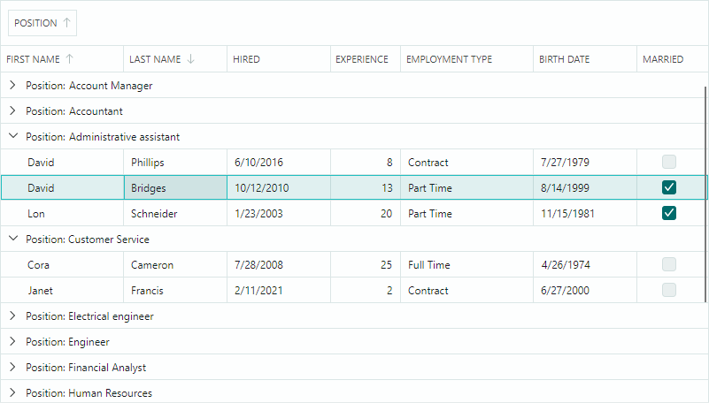

# Data Grid

`DataGridControl` allows you to display data from any data source in a column and row format. It provides high-performance data shaping and rich editing functionality. The control supports data sorting and grouping by any number of columns. The built-in auto-filter row and search panel allows a user to quickly locate data. You can embed any editor in grid cells to format and edit cell data in a specific manner.

- Data Binding — You can bind the control to an IList, IBindingList, DataTable or any IEnumerable data source.
- Data Sorting — Allows you to sort data against an unlimited number of columns.
- Data Grouping — The data grouping feature combines rows with identical column values into the same data groups. You can group the control's data against multiple columns.
- Styles — Allow you to customize the appearance settings of the controls' elements in various states.
- Data Edit Operations — The grid control uses default Eremex editors to present and edit cell values of common data types. You can embed custom editors in cells to render and edit cell values in a specific manner.
- Data Validation — The validation mechanism helps you check a user's input and data source's values, and show errors in invalid cells.
- Built-in and Custom Context Menus.
- Unbound Columns — You can add unbound columns (those that are not bound to data source fields), and populate them with data manually, using an event.
- Column Resize and Drag-and-Drop Operations.
- Column Chooser — Allows a user to access all columns, manage the column visibility, and rearrange the columns.
- Search Panel — Helps a user quickly locate rows by the data they contain.
- Auto Filter Row — A special row that allows a user to filter data against columns.
- Column Header Templates – Allow you to display custom content in column headers, including images.
- Multiple Row Selection (Highlight) — You can enable multiple row selection mode to allow a user to select (highlight) multiple rows at one time.
- Data Annotation Attribute Support — The Data Grid control takes into account dedicated Data Annotation attributes applied to the data source's properties. You can use Data Annotation attributes to specify custom visibility, position, read-only state, and display name for auto-generated columns.
