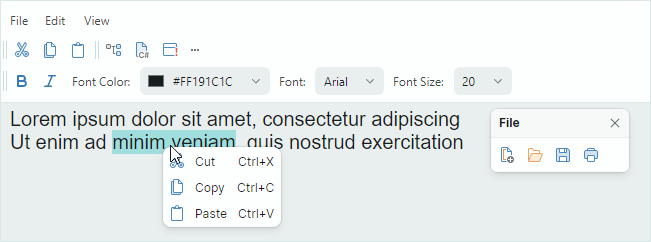

# Toolbars and Menus

The Eremex Control Library includes the `ToolbarManager` component that helps you create a traditional Toolbar&amp;Menu UI in your application. The `ToolbarManager` offers rich capabilities to arrange and manage bars, create context menus, change toolbar view and behavior settings, and customize bars at runtime.

You can use multiple bar items to create the menu UI: regular buttons, check buttons, editors, labels, sub-menus and group items.

The Eremex toolbar controls are user-customizable. Users can choose to display the commands they need. 

The main features of the Toolbar&amp;Menu controls include:

- User customization:
    - Bar drag-and-drop — Allows a user to rearrange bars using drag thumbs.
    - Customization mode and Customization Window — In the Customization Window, a user can change the visibility of existing toolbars, and create custom toolbars. A user can hide, restore, and move toolbar items using drag-and-drop operations.
    - Quick customization — A user can move items within and between bars using drag-and-drop by holding the Alt key down. There is no need to activate customization mode/Customization Window to perform quick customization.

- Numerous bar layout options:
    - Horizontal and vertical directions of individual bars.
    - Any position within a window.
    - Bar stretching mode.
    - Bar adaptive layout — Toolbars automatically hide and restore their items when the space they accommodate is changed.
    - An option to show/hide bar drag thumbs.
    - An option to show/hide bar customization buttons.
    
- Supported bar items: ButtonItem, CheckItem, TextItem, EditorItem, MenuItem, GroupItem, and CheckGroupItem.
- Context menus — You can create context menus for external controls. The style settings of all Eremex context menus are consistent with other Eremex Toolbar&amp;Menu controls.

## Documentation

- [English Documentation](https://eremexcontrols.net/articles/controls/toolbars-and-menus.html)
