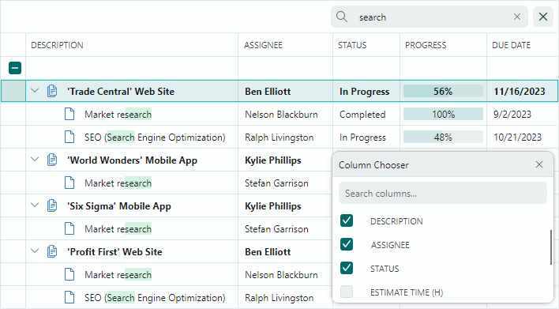
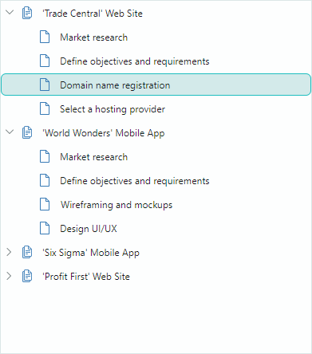

# TreeList and TreeView Controls

The Eremex Controls library includes two data-aware controls to display hierarchical data in the form of a tree — `TreeListControl` and `TreeViewControl`. They render data source items as hierarchical nodes (rows).

`TreeList` control supports multiple columns:

`TreeView` control is a single-column component:

`TreeListControl` and `TreeViewControl` have one ancestor, so they share multiple features:

- Data Binding — You can bind the controls to self-referential (flat) and hierarchical data sources.
- Unbound Mode — Allows you to manually create the node structure.
- Built-in Node Checkboxes — Allow you to select individual nodes.
- Data Sorting — Allows you to sort sibling nodes in ascending or descending order. TreeList supports data sorting against one or multiple columns. 
- Node Images — Allow you to display custom images before cell values in the hierarchy column.
- Node Drag-and-Drop
- High Performance for Large Volumes of Data — The data virtualization mechanism for vertical and horizontal scrolling boosts the control's performance when displaying large numbers of rows and columns.
- Styles — Allow you to customize the appearance settings of the controls' elements in various states.
- Search Panel — Helps a user quickly locate nodes by the data they contain.
- Data Edit Operations — The controls use default Eremex editors to present and edit cell values of common data types. You can embed custom editors in cells to render and edit cell values in a specific manner.
- Data Validation — The validation mechanism helps you check a user's input and data source's values, and show errors in invalid cells.
- Built-in and Custom Context Menus.
- Data Annotation Attribute Support — The TreeList and TreeView controls take into account dedicated Data Annotation attributes applied to the data source's properties. You can use Data Annotation attributes to specify custom visibility, position, read-only state, and display name for auto-generated columns.

TreeList-specific features include:

- Unbound Columns — You can add unbound columns (those that are not bound to data source fields) and populate them with data manually, using an event.
- Column Resize and Drag-and-Drop Operations.
- Column Chooser — Allows a user to access all columns, manage the column visibility, and rearrange the columns.
- Auto Filter Row — A special row that allows a user to filter data against columns.
- Column Header Templates – Allow you to display custom content in column headers, including images.
- Multiple Node Selection (Highlight) — You can enable multiple node selection mode to allow a user to select (highlight) multiple nodes at one time.

## Documentation

- [English Documentation](https://eremexcontrols.net/articles/controls/treelist.html)
